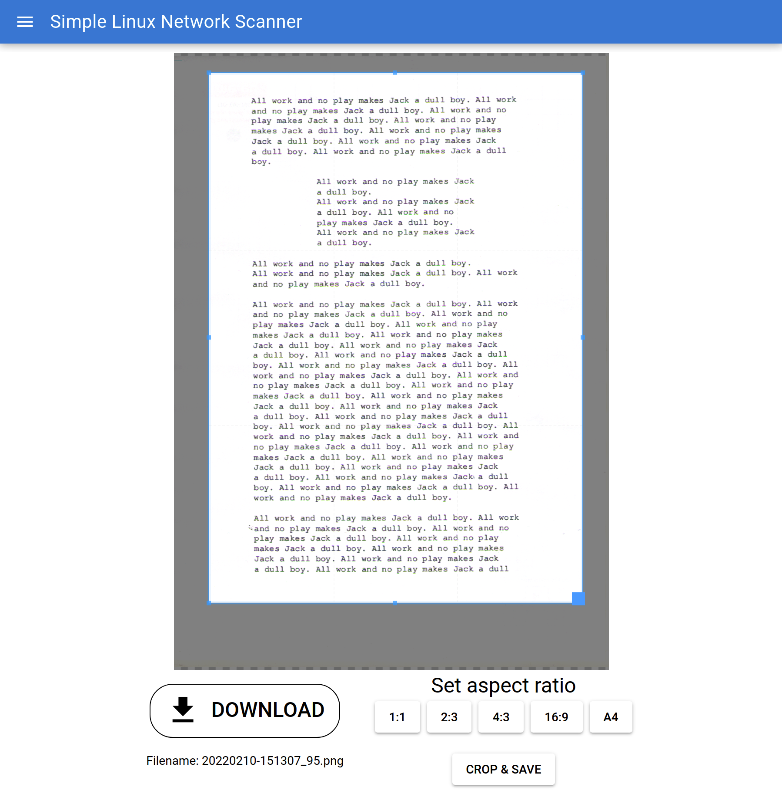
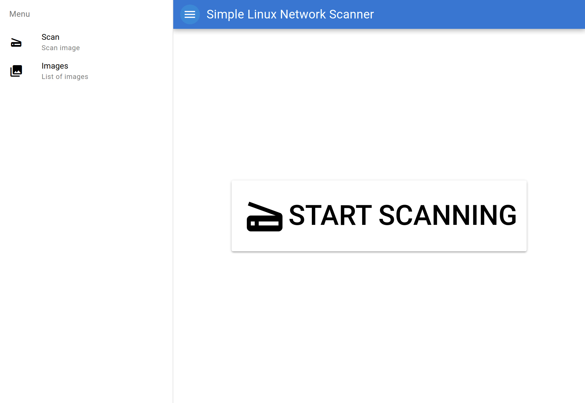
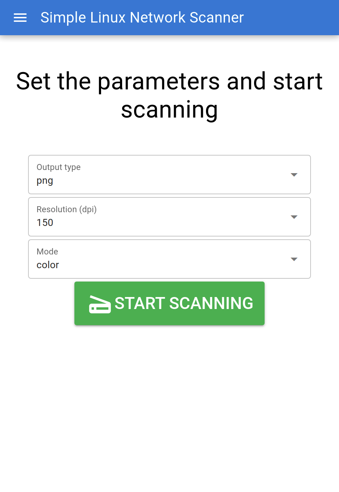
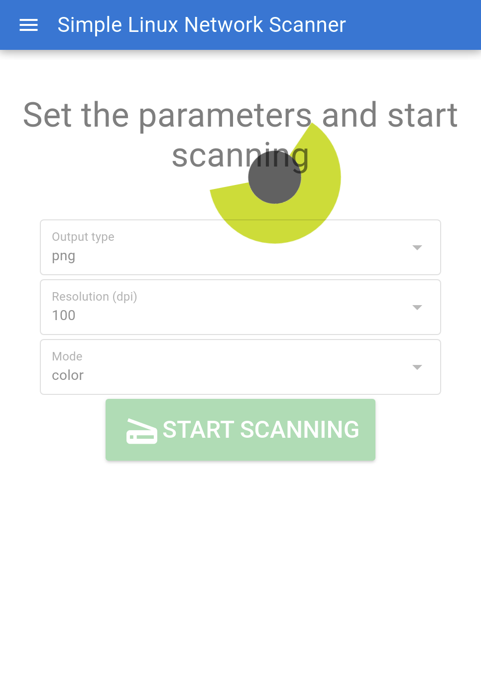
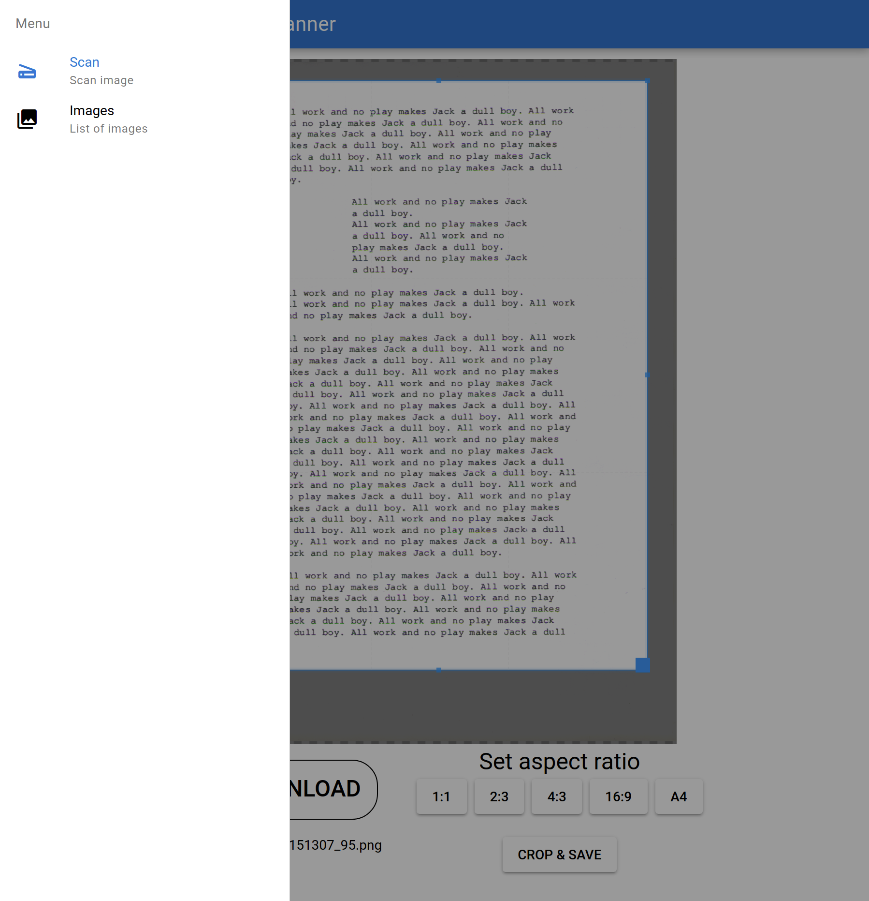
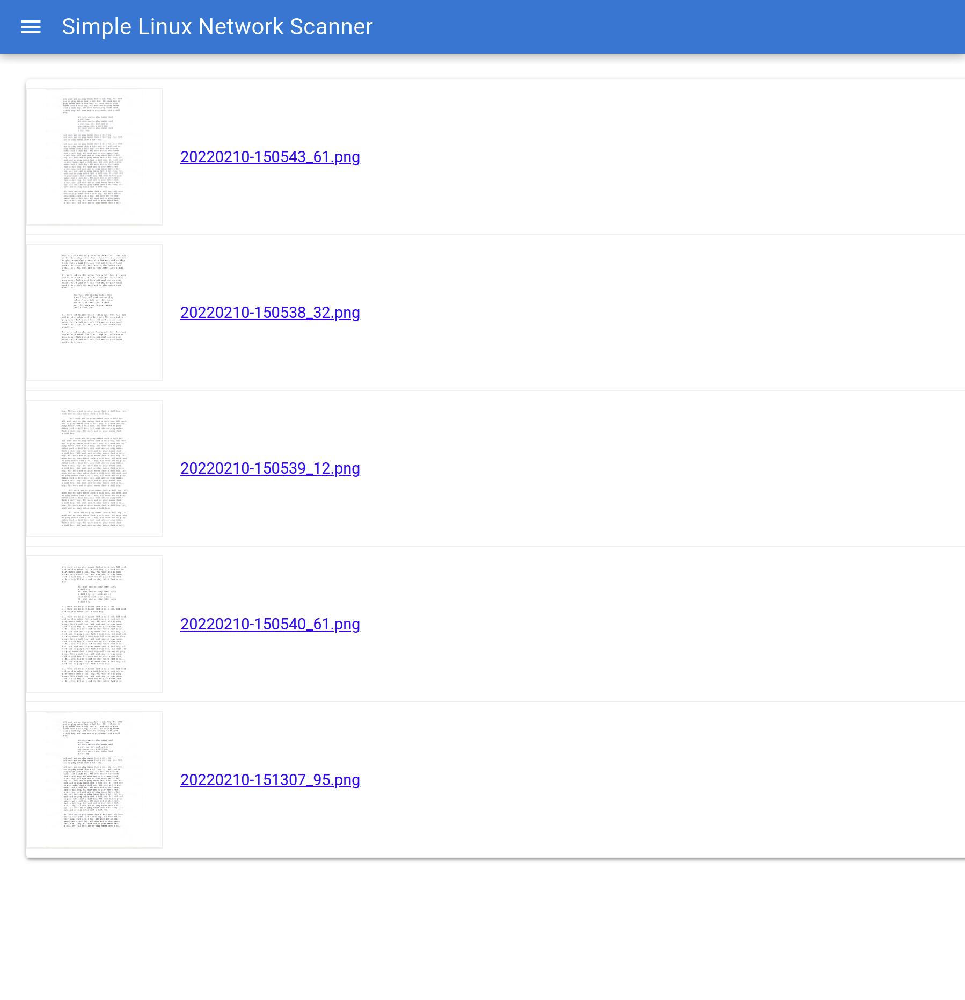

<p align="center">
    
</p>
<p align="center">
    <em>Simple Web-based Interface for Scanner</em>
</p>

<p align="center" style="margin-top: 20pt;">
    
</p>

This is simple web-based interface for scanner. It allows share the scanner via IP address which makes it accessible by web browser. The frontend interface allows user to crop the image as well as browse previousely scanned images.

From technical perspective it is simply SANE scanimage wrapper. There are quite many things to do to make it production (see TODO section).

## Requirements

- Linux
- SANE (Scanner Access Now Easy) properly configured (`scanimage` tool)
- Python >= 3.8
- [Optionally] NPM (for frontend app building)


## Build app

```
sh build.sh
```

## Run

1. Download the latest release from: 
2. Run below command (extracts, installs dependencies and executes):

```
mkdir -p swis && \
tar -C swis -xvzf swis.tar.gz && \
cd swis && \
pip install -r requirements.txt && \
python swis.py --ip localhost --port 5520
```

3. Then you can access the scanner through http://localhost:5520

**❗IMPORTANT❗** Change the IP (`localhost` above) to appropriate host IP address of the host if you want to access the scanner from other computers (or other devices).


## Screenshots

### Welcome screen


### Scanning parameters


### Scanning in progress


### Cropping scanned image


### Side menu


### List of scanned images



## TODO:

- [ ] error handling
- [ ] pip package
- [ ] automatically add service with `systemctl`
- [ ] better user interface (i.e. image remove button)
- [ ] move actions to vuex
